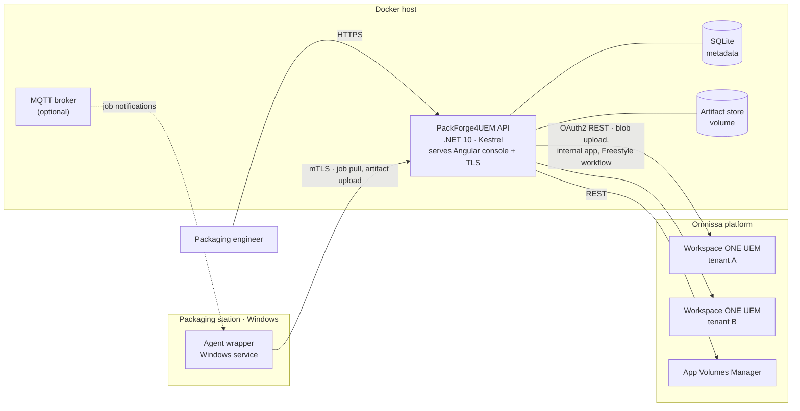

# PackForge4UEM

*PackForge for Omnissa Workspace ONE UEM*

**Package lifecycle console for Omnissa Workspace ONE UEM and App Volumes.**
[](LICENSE)
Build a package once, version it, publish it to many UEM tenants — without hand-carrying blobs through the admin console.

> Status: early development. Target of the first public release: **mid-September 2026**. See [docs/status.md](docs/status.md).

---

## Why this exists

Packaging an application for an Omnissa estate is still largely manual work. An engineer captures or repacks the installer on a packaging station, uploads the blob through the UEM console, wires up deployment and assignment groups by hand, and repeats the whole sequence for every tenant. Nothing keeps a shared record of which version went where, and nothing guarantees that the App Volumes Agent — without which an AppStack will not attach — is actually in place before the application lands.

PackForge4UEM closes that gap. One declarative package manifest becomes a versioned, hash-pinned artifact set, published to any number of Workspace ONE UEM tenants with a generated Freestyle Orchestrator workflow that gets the install order and its conditions right.

## What it does

- **Declarative packages.** A package is a JSON manifest: source with a SHA-256 pin, build template, output artifacts, prerequisites, per-tenant assignment mapping. Import it, export it, keep it in Git.
- **Templates over scripting.** Manifests inherit from build templates (`msi-repack`, `exe-wrap`, `appstack-only`), so a typical package is a dozen lines. Imperative steps stay available as an escape hatch for awkward installers.
- **Immutable versioning.** Manifest plus source hash determines the artifact. The same input reproduces the same package, and the record of how a package came to be survives the engineer who built it.
- **Multi-tenant publishing.** One package version fans out to many UEM tenants. Logical names in the manifest are resolved to tenant-local application and smart group IDs at publish time; republishing updates a workflow instead of cloning it.
- **Freestyle Orchestrator as the deployment engine.** The console generates Freestyle workflow JSON rather than inventing a competing orchestration language. Install order, conditions and branching are expressed where the platform already executes them.
- **App Volumes as a first-class target.** Every package carries its App Volumes AppStack alongside its MSI, and the App Volumes Agent is a managed prerequisite enforced as the first conditional step of the workflow.
- **Agent-driven builds.** A Windows service on the packaging station executes build jobs, hashes and uploads artifacts, and drives the import. The server never reaches into the station.

## Architecture



The API container serves the compiled Angular console as static content and terminates TLS itself — there is no separate reverse proxy to configure. The agent runs outside Docker, on Windows, because that is where MSI work has to happen; its only link to the stack is an outbound HTTPS connection.

## Package manifest

```json
{
  "schemaVersion": "1.0",
  "id": "7zip",
  "name": "7-Zip",
  "version": "24.09.0",
  "extends": "msi-repack",
  "source": {
    "type": "url",
    "uri": "https://www.7-zip.org/a/7z2409-x64.msi",
    "sha256": "b1a1e2b1c0d9e8f7a6b5c4d3e2f1a0b9c8d7e6f5a4b3c2d1e0f9a8b7c6d5e4f3"
  },
  "artifacts": {
    "msi": { "target": "uem-internal-app" },
    "appStack": { "target": "app-volumes", "packageName": "7-Zip 24.09" }
  },
  "prerequisites": [
    { "package": "omnissa-appvolumes-agent", "minVersion": "4.0" }
  ],
  "deployment": {
    "engine": "freestyle",
    "assignments": [
      { "group": "pilot-workstations", "phase": 1 },
      { "group": "all-workstations", "phase": 2 }
    ]
  },
  "tenants": ["lab", "prod-emea"]
}
```

A published JSON Schema validates the manifest in the console **before** a build job starts, rather than twenty minutes into it.

## Technology

| Layer | Choice |
| --- | --- |
| Console | Angular 22 |
| API | .NET 10, ASP.NET Core, Kestrel (static hosting + TLS) |
| Persistence | SQLite (metadata only, WAL mode) |
| Data access | NHibernate + FluentNHibernate |
| Schema | FluentMigrator, versioned migrations |
| Artifacts | Filesystem volume, SHA-256 addressed |
| Agent | .NET 10 Windows service, mTLS client certificate |
| Notifications | MQTT (optional) with mandatory polling fallback |
| Deployment | Docker Compose |
| API contract | OpenAPI, typed client generated for the console |

Binaries never go into SQLite. The database holds metadata and a path plus hash; the artifact store holds the files, so a backup stays a file copy and the database stays small.

## Getting started

> Not yet runnable — the compose stack lands in week 1. See [docs/status.md](docs/status.md).

```bash
git clone https://github.com/franekSoftSF/PackForge4UEM.git
cd PackForge4UEM
docker compose up
```

## Project status and roadmap

`docs/status.json` is the machine-readable source of truth for epics, tasks, ownership and definition of done. `docs/status.md` is the human-readable view generated from it. Work is split between two tracks — frontend and backend — synchronised through the OpenAPI contract.

## Contributing

Contributions are welcome once the first milestone lands. The project is **English-only** across code, commits, documentation and issues. Community-contributed package templates are an explicit goal: a manifest that packages a common application correctly is as valuable a contribution as code.

## License

MIT — see [LICENSE](LICENSE).

## Disclaimer

This is an independent, community project. It is **not affiliated with, endorsed by, or supported by Omnissa**. Workspace ONE, App Volumes, Freestyle Orchestrator and related names are trademarks of their respective owners and are used here solely to describe interoperability.
